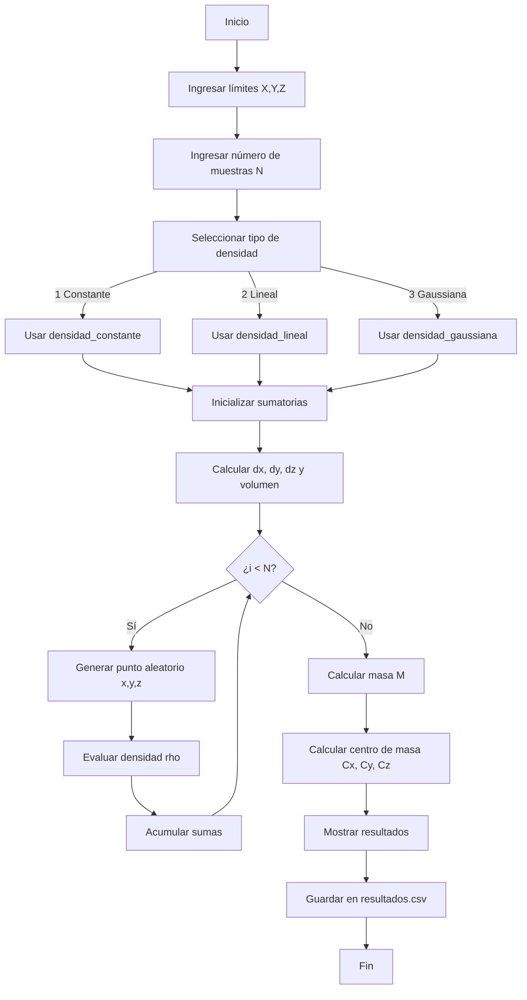

# README.md — Cálculo de Masa y Centro de Masa mediante Integración Triple en C

Este proyecto implementa un sistema optimizado en C para calcular la masa total y el centro de masa de un sólido tridimensional, utilizando integración numérica por el método de Monte Carlo. El código está organizado modularmente y optimizado para ser rápido y eficiente.

---

## 📁 Estructura del Proyecto

```
tripleintegral/
├── src/
│   ├── main.c
│   ├── densidades.c
│   └── integracion.c
├── include/
│   ├── densidades.h
│   └── integracion.h
├── obj/               ← generado automáticamente
├── programa_vectorial ← ejecutable
└── Makefile
```

---

## 🧠 Conceptos Implementados

### ✔️ Masa

```
M = ∭ ρ(x, y, z) \, dV
```

### ✔️ Centro de masa

```
x̄ = (1/M) ∭ xρ \, dV
ȳ = (1/M) ∭ yρ \, dV
z̄ = (1/M) ∭ zρ \, dV
```

### ✔️ Densidades disponibles

* **Constante** → ρ = 1
* **Lineal** → ρ = x + y + z
* **Gaussiana** → ρ = exp(-(x² + y² + z²))

### ✔️ Método de integración implementado

* **Monte Carlo 3D optimizado**

---

## ▶️ Cómo Compilar

En la terminal, ejecutar:

```
make
```

Esto generará el ejecutable:

```
./programa_vectorial
```

Para limpiar objetos y ejecutable:

```
make clean
```

Para compilar y ejecutar automáticamente:

```
make run
```

---

## ▶️ Cómo Ejecutar el Programa

```
./programa_vectorial
```

El programa solicitará:

* Límites en X
* Límites en Y
* Límites en Z
* Número de muestras N
* Tipo de densidad (1–3)

---

## 📊 Archivo de Salida

El programa genera:

```
resultados.csv
```

Con el formato:

```
Metodo,Densidad,N,M,x_bar,y_bar,z_bar,Tiempo
```

Ejemplo:

```
MonteCarlo,Gaussiana,100000,100000,100000,12.5831,0.1020,-0.0030,0.2210,0.0872
```

---

## ❓ Preguntas a ChatGPT como orientación

Estas fueron algunas de las preguntas realizadas durante el desarrollo del proyecto:

* ¿Cómo organizar el proyecto en múltiples archivos .c y .h?
* ¿Cómo optimizar el algoritmo Monte Carlo sin alterar la estructura del programa?
* ¿Cómo compilar correctamente usando VS Code con MinGW?
* ¿Cómo modificar funciones para que acepten densidades variables?
* ¿Cómo crear un Makefile rápido y con directorio obj/?
* ¿Cómo mejorar la velocidad manteniendo la misma lógica?
* ¿Cómo guardar resultados en CSV sin sobrescribirlos?

---

## 🔷 Diagrama de Flujo del Programa



## 🧑‍💻 Autor

Juan Fernando Martinez Cabrera
